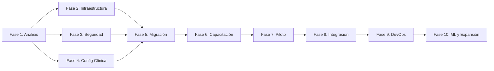

# Plan de Implementación - dMart UCI System

**Versión:** 1.0  
**Fecha:** Mayo 2026  
**Estado:** En desarrollo activo

---

## Resumen Ejecutivo

Este documento describe el plan de implementación del sistema **dMart UCI** en un entorno hospitalario real, dividido en **10 fases progresivas**. Cada fase incluye objetivos, tareas específicas, componentes a desarrollar/agregar al sistema existente, y criterios de éxito.

El plan está diseñado para minimizar riesgos, garantizar la adopción por parte del personal médico, y asegurar una transición gradual desde sistemas legacy hacia la plataforma dMart.

---

## Fase 1: Análisis y Levantamiento de Requisitos

**Duración estimada:** 2-3 semanas  
**Dependencias:** Ninguna  
**Riesgo:** Bajo

### Objetivos
- Configurar la institución hospitalaria dentro del sistema
- Definir parámetros clínicos locales (rangos de escalas, protocolos)
- Identificar flujos de trabajo actuales del personal UCI

### Qué agregar al sistema

#### Backend
- [ ] **Modelo `InstitucionConfig`** en `dmart-shared/src/models.rs`:
  - Nombre del hospital, dirección, RIF, teléfono, email
  - Logotipo (URL base64 o ruta)
  - Zona horaria, locale, moneda
  - Unidades UCI (múltiples si aplica)
  - Parámetros de escalas clínicas (rangos personalizables)
- [ ] **API endpoints** en `dmart-server/src/api/admin.rs`:
  - `GET /api/admin/institucion` - Obtener configuración
  - `PUT /api/admin/institucion` - Actualizar configuración
  - `POST /api/admin/institucion` - Crear configuración inicial
- [ ] **Funciones DB** en `dmart-server/src/db.rs`:
  - `get_institucion_config()`
  - `upsert_institucion_config()`
- [ ] **Seed automático** de configuración por defecto al iniciar el servidor

#### Frontend
- [ ] **Pestaña "Institución"** en el panel de administración (`dmart-app/src/pages/admin.rs`)
- [ ] **Formulario de configuración** con campos: nombre, dirección, RIF, contacto
- [ ] **Selector de parámetros clínicos** por especialidad/unidad

### Criterios de éxito
- [ ] Administrador puede configurar los datos de la institución desde la UI
- [ ] La configuración persiste entre reinicios del servidor
- [ ] Los parámetros clínicos se reflejan en los cálculos de scores

---

## Fase 2: Preparación del Entorno Tecnológico

**Duración estimada:** 2-3 semanas  
**Dependencias:** Fase 1  
**Riesgo:** Bajo

### Objetivos
- Contenerizar la aplicación para despliegue reproducible
- Establecer healthchecks y monitoreo básico
- Configurar respaldo automático de datos

### Qué agregar al sistema

#### Infraestructura
- [ ] **`docker-compose.yml`** - Servicio completo con:
  - `dmart-server` (con WASM embebido)
  - `valkey` (caché de sesiones)
  - Volúmenes persistentes para datos
  - Healthcheck configurado
  - Red interna aislada
- [ ] **`Dockerfile`** - Multi-stage build para optimizar tamaño:
  - Stage 1: Build Rust + WASM (imagen rust:latest)
  - Stage 2: Runtime mínimo (distroless)
- [ ] **`Dockerfile.simple`** - Para desarrollo rápido sin optimización WASM
- [ ] **`.env.example`** - Variables de entorno documentadas

#### Backend
- [ ] **Healthcheck endpoint mejorado** (`GET /api/health`):
  - Estado de conexión a SurrealDB
  - Estado de conexión a Valkey
  - Uptime del servidor
  - Versión del sistema
  - Uso de memoria (opcional)
- [ ] **Script de backup** (`scripts/backup.sh`):
  - Backup automático de `data/dmart.db`
  - Compresión con rotación (7 días)
  - Notificación en caso de fallo

### Criterios de éxito
- [ ] `docker compose up` funciona sin configuración manual
- [ ] Healthcheck reporta correctamente estado de todos los servicios
- [ ] Backup automático se ejecuta y restaura correctamente

---

## Fase 3: Configuración de Seguridad y Accesos

**Duración estimada:** 2-3 semanas  
**Dependencias:** Fase 2  
**Riesgo:** Medio

### Objetivos
- Implementar políticas de seguridad corporativas
- Configurar autenticación multifactor
- Integrar con directorio activo/LDAP si aplica

### Qué agregar al sistema

#### Backend
- [ ] **Políticas de contraseñas** en `dmart-server/src/auth.rs`:
  - Longitud mínima/máxima
  - Complejidad (mayúsculas, números, símbolos)
  - Expiración forzada (90 días)
  - Historial de contraseñas (no repetir últimas 5)
- [ ] **Módulo de invitación de usuarios**:
  - `POST /api/admin/invite` - Enviar invitación por email
  - Token de invitación con expiración
  - Flujo: Invitación → Registro → Activación
- [ ] **Log de acceso** con metadatos:
  - IP, User-Agent, dispositivo, ubicación geográfica
  - Timestamp de último acceso por usuario
  - Detección de accesos desde ubicaciones inusuales
- [ ] **Integración LDAP/AD** (esqueleto):
  - `POST /api/auth/ldap` - Autenticación delegada
  - Sincronización programada de usuarios/grupos

#### Frontend
- [ ] **Página de configuración de perfil**:
  - Cambio de contraseña con validación de política
  - Historial de sesiones activas
  - Preferencias de notificaciones

### Criterios de éxito
- [ ] Usuarios no pueden crear contraseñas débiles
- [ ] Invitaciones por email funcionan correctamente
- [ ] Log de acceso registra todos los inicios de sesión
- [ ] Integración LDAP permite autenticar contra AD

---

## Fase 4: Configuración Clínica Inicial

**Duración estimada:** 3-4 semanas  
**Dependencias:** Fase 1, Fase 3  
**Riesgo:** Medio

### Objetivos
- Completar el catálogo de recursos clínicos
- Implementar mapa visual de la planta UCI
- Configurar diagnósticos y protocolos médicos

### Qué agregar al sistema

#### Backend
- [ ] **Catálogo CIE-10 (ICD-10)** en `dmart-shared/src/models.rs`:
  - Modelo `Diagnostico` con código CIE-10 + descripción
  - Endpoint de búsqueda: `GET /api/diagnosticos?q=`
  - Dataset precargado con ~300 diagnósticos comunes en UCI
- [ ] **Perfiles de personal** extendidos:
  - Especialidad médica principal
  - Sub-especialidades
  - Horario/turno
  - Número de licencia médica
- [ ] **Historial de asignaciones de cama**:
  - Modelo `AsignacionCama` con fecha inicio/fin
  - Endpoint: `GET /api/admin/camas/{id}/historial`

#### Frontend
- [ ] **Mapa visual de planta UCI**:
  - Grid de camas con estado (color-coded)
  - Arrastrar y soltar para reasignar pacientes
  - Tooltip con información del paciente
  - Vista general de ocupación en tiempo real
- [ ] **Selector de diagnósticos** con autocompletado CIE-10
- [ ] **Calendario de turnos** del personal

### Criterios de éxito
- [ ] Mapa de planta muestra estado actualizado de todas las camas
- [ ] Búsqueda de diagnósticos CIE-10 funciona con tiempo real
- [ ] Historial de asignaciones de cama es trazable

---

## Fase 5: Migración de Datos e Importación

**Duración estimada:** 3-4 semanas  
**Dependencias:** Fase 4  
**Riesgo:** Alto

### Objetivos
- Migrar pacientes históricos desde sistema legacy
- Validar integridad de datos migrados
- Establecer procedimiento de importación segura

### Qué agregar al sistema

#### Backend
- [ ] **Módulo de importación masiva** en `dmart-server/src/api/import.rs`:
  - `POST /api/import/csv` - Importar pacientes desde CSV
  - `POST /api/import/json` - Importar pacientes desde JSON
  - `POST /api/import/measurements` - Importar mediciones históricas
- [ ] **Validación de datos importados**:
  - Esquema de validación configurable
  - Reporte de errores con línea/columna
  - Modo "dry-run" para previsualizar resultados
- [ ] **Log de importaciones** en `dmart-shared/src/models.rs`:
  - Modelo `ImportLog` con timestamp, archivo, registros, errores
  - Endpoint: `GET /api/import/history`

#### Frontend
- [ ] **Página de importación** en panel admin:
  - Drag & drop de archivos
  - Vista previa de datos antes de importar
  - Progreso de importación en tiempo real
  - Reporte de resultados con errores
- [ ] **Tabla de historial** de importaciones

### Criterios de éxito
- [ ] Importación de 1000+ pacientes en < 30 segundos
- [ ] Validación detecta y reporta errores de formato
- [ ] Modo dry-run no modifica la base de datos
- [ ] Historial completo de todas las importaciones

---

## Fase 6: Capacitación y Entrenamiento

**Duración estimada:** 2-3 semanas  
**Dependencias:** Fase 5  
**Riesgo:** Bajo

### Objetivos
- Proveer entorno seguro para capacitación del personal
- Generar datos clínicos sintéticos realistas
- Facilitar la adopción del sistema

### Qué agregar al sistema

#### Backend
- [ ] **Modo sandbox/entrenamiento**:
  - Flag `modo_entrenamiento` en configuración institucional
  - Base de datos separada o prefijo `sandbox_` en tablas
  - Datos sintéticos no persisten al cerrar sesión
- [ ] **Generador de pacientes sintéticos** en `dmart-server/src/api/sandbox.rs`:
  - `POST /api/sandbox/generate` - Generar N pacientes con datos realistas
  - `POST /api/sandbox/measurements` - Generar mediciones históricas simuladas
  - Algoritmo que produce variaciones clínicas coherentes

#### Frontend
- [ ] **Indicador visual** de modo sandbox (barra amarilla superior)
- [ ] **Botón "Generar datos de prueba"** en admin
- [ ] **Tour guiado** interactivo paso a paso:
  - Highlight de elementos clave
  - Tooltips explicativos
  - Progreso del tour
- [ ] **Escenario de capacitación**:
  - Paciente simulado con evolución temporal
  - Ejercicios de medición guiados

### Criterios de éxito
- [ ] Personal médico puede practicar sin afectar datos reales
- [ ] Datos sintéticos son clínicamente plausibles
- [ ] Tour guiado cubre todas las funcionalidades principales

---

## Fase 7: Pruebas Piloto (Operación en Paralelo)

**Duración estimada:** 4-6 semanas  
**Dependencias:** Fase 6  
**Riesgo:** Alto

### Objetivos
- Operar dMart en paralelo con el sistema existente
- Validar precisión de cálculos clínicos
- Obtener retroalimentación del personal médico

### Qué agregar al sistema

#### Backend
- [ ] **Módulo de comparación** en `dmart-server/src/api/pilot.rs`:
  - `POST /api/pilot/compare/score` - Comparar score calculado vs referencia
  - `GET /api/pilot/discrepancies` - Listar discrepancias reportadas
  - `POST /api/pilot/discrepancies/{id}/review` - Marcar como revisada
- [ ] **Flag de validación clínica** en mediciones:
  - Campo `validacion_clinica: Option<ValidacionEstado>`
  - Enum `ValidacionEstado { Pendiente, Validado, Rechazado, EnRevision }`
  - Responsable de la validación (médico)
- [ ] **Reporte de discrepancia**:
  - Modelo `DiscrepanciaReport` con score_calculado, score_referencia, diferencia
  - Endpoint: `GET /api/pilot/report` - Reporte agregado

#### Frontend
- [ ] **Tablero de comparación**:
  - Tabla de scores lado a lado (dMart vs Sistema Actual)
  - Indicador de diferencia (color: verde < 5%, amarillo 5-10%, rojo > 10%)
  - Filtros por período, escala, médico
- [ ] **Formulario de reporte** de discrepancia
- [ ] **Panel de revisión** para jefe de servicio

### Criterios de éxito
- [ ] 95%+ de scores calculados coinciden con referencia
- [ ] Médicos pueden reportar discrepancias en < 1 minuto
- [ ] Reporte semanal de comparación generado automáticamente
- [ ] Retroalimentación documentada del personal

---

## Fase 8: Integración con Sistemas Hospitalarios

**Duración estimada:** 6-8 semanas  
**Dependencias:** Fase 7  
**Riesgo:** Alto

### Objetivos
- Integrar dMart con sistemas hospitalarios existentes
- HL7 FHIR R4 para interoperabilidad estándar
- Conexión con monitores de signos vitales
- Integración con sistemas de laboratorio

### Qué agregar al sistema

#### Backend
- **Módulo FHIR** (`dmart-server/src/api/fhir/`):
  - `GET /fhir/Patient` - Listar pacientes como recurso FHIR
  - `GET /fhir/Patient/{id}` - Paciente individual en formato FHIR
  - `GET /fhir/Observation` - Mediciones como observaciones FHIR
  - `GET /fhir/Observation/{id}` - Observación individual
  - `POST /fhir/$import` - Importar recursos FHIR
  - Mapeo: dMart models → FHIR R4 resources
- **Conector HL7 V2** (`dmart-server/src/api/hl7.rs`):
  - Parseo de mensajes HL7 (ADT, ORU, ORM)
  - Mapeo a pacientes/mediciones dMart
  - Servicio TCP listener para mensajes entrantes
- **Integración de laboratorio**:
  - Modelo `ResultadoLaboratorio` en `dmart-shared/src/models.rs`
  - Endpoint: `POST /api/lab/results` - Resultados batch
  - Mapeo automático a campos de `ApacheIIData`
- **WebSocket** para tiempo real:
  - `GET /ws/patient/{id}` - Stream de signos vitales
  - `GET /ws/alerts` - Alertas de deterioro en tiempo real
  - Reconexión automática con backoff

#### Frontend
- [ ] **Widget de monitoreo en tiempo real** en dashboard:
  - Gráficos de signos vitales actualizándose en vivo
  - Alertas visuales/sonoras
  - Histórico de última hora

### Criterios de éxito
- [ ] Servidor FHIR pasa suite de validación de recursos
- [ ] Monitores de signos vitales envían datos correctamente
- [ ] Resultados de laboratorio se integran automáticamente
- [ ] WebSocket mantiene conexión estable > 24 horas

---

## Fase 9: Automatización y DevOps

**Duración estimada:** 2-3 semanas  
**Dependencias:** Fase 8  
**Riesgo:** Bajo

### Objetivos
- Establecer pipeline CI/CD completo
- Automatizar backup y monitoreo
- Implementar métricas de rendimiento

### Qué agregar al sistema

#### Infraestructura
- [ ] **GitHub Actions** (`.github/workflows/ci.yml`):
  - `lint` - Clippy + format check
  - `test` - Tests unitarios + integración
  - `build-server` - Build release server binary
  - `build-wasm` - Build WASM frontend
  - `docker` - Build y push imagen Docker
  - `security-audit` - cargo audit
- [ ] **Docker Compose producción** (`docker-compose.prod.yml`):
  - Reverse proxy (Caddy/Traefik) con TLS automático
  - Múltiples réplicas de dmart-server
  - Valkey cluster para sesiones compartidas
  - Healthchecks con auto-reinicio
- [ ] **Monitoreo**:
  - `docker-compose.mon.yml` - Prometheus + Grafana + Loki
  - Métricas expuestas en `GET /api/metrics`
  - Dashboards pre-configurados para Grafana
  - Alertas configuradas (caída servidor, disco lleno, etc.)

#### Backend
- [ ] **Endpoint de métricas** (`GET /api/metrics`):
  - Requests por segundo
  - Latencia P50/P95/P99
  - Conexiones activas
  - Tamaño de base de datos

#### Scripts
- [ ] **`scripts/backup.sh`** mejorado:
  - Backup cifrado con GPG
  - Upload a S3-compatible (MinIO, AWS S3)
  - Política de retención configurable
- [ ] **`scripts/restore.sh`** - Restauración desde backup
- [ ] **`scripts/monitor.sh`** - Healthcheck continuo con notificación

### Criterios de éxito
- [ ] CI/CD completa build + test + deploy en < 5 minutos
- [ ] Backups automáticos se ejecutan diariamente
- [ ] Dashboards de Grafana muestran métricas del sistema
- [ ] Alertas notifican ante cualquier anomalía

---

## Fase 10: Mejora Continua y Expansión

**Duración estimada:** 8-12 semanas  
**Dependencias:** Fase 9  
**Riesgo:** Medio

### Objetivos
- Implementar analytics predictivo con Machine Learning
- Expandir a múltiples sedes
- Certificaciones y cumplimiento normativo

### Qué agregar al sistema

#### Backend - Machine Learning
- [ ] **Módulo ML** con Burn framework (`dmart-server/src/ml/`):
  - `predict_deterioro()` - LSTM para predicción 6-12 horas
  - `detect_sepsis()` - Detección temprana de sepsis (SOFA + ML)
  - `mortality_risk_ml()` - Ensemble APACHE + ML
  - Entrenamiento y actualización de modelos
- [ ] **Explicabilidad (XAI)**:
  - SHAP values para importancia de features
  - LIME explanations para predicciones individuales
  - Reporte de factores contribuyentes

#### Backend - Multi-sede
- [ ] **Modelo `Sede`** en `dmart-shared/src/models.rs`:
  - Nombre, dirección, contacto
  - Configuración independiente por sede
- [ ] **Dashboard consolidado** multi-sede:
  - Estadísticas agregadas
  - Comparación entre sedes
  - Ocupación global

#### Backend - Compliance
- [ ] **Módulo de cumplimiento**:
  - `GET /api/compliance/hipaa` - Reporte HIPAA
  - `GET /api/compliance/gdpr` - Reporte GDPR
  - `GET /api/compliance/audit` - Exportación de auditoría
  - Retención de datos configurable por tipo

#### Frontend
- [ ] **Dashboard ejecutivo con ML**:
  - Predicciones de deterioro visualizadas
  - Alertas inteligentes con priorización
  - Heatmap de riesgo por cama
- [ ] **Selector de sede** en navbar
- [ ] **Reportes exportables** (PDF, HTML, JSON)

### Criterios de éxito
- [ ] Modelos ML alcanzan AUC > 0.85 en validación
- [ ] Sistema opera en 2+ sedes simultáneamente
- [ ] Reportes de cumplimiento generados bajo demanda
- [ ] Dashboard ejecutivo adoptado por dirección médica

---

## Resumen de Dependencias

## Cronograma Estimado

| Fase | Duración | Inicio estimado |
|------|----------|-----------------|
| Fase 1: Análisis | 2-3 sem | Semana 1 |
| Fase 2: Infraestructura | 2-3 sem | Semana 3 |
| Fase 3: Seguridad | 2-3 sem | Semana 4 |
| Fase 4: Config Clínica | 3-4 sem | Semana 5 |
| Fase 5: Migración | 3-4 sem | Semana 8 |
| Fase 6: Capacitación | 2-3 sem | Semana 11 |
| Fase 7: Piloto | 4-6 sem | Semana 13 |
| Fase 8: Integración | 6-8 sem | Semana 17 |
| Fase 9: DevOps | 2-3 sem | Semana 23 |
| Fase 10: ML y Expansión | 8-12 sem | Semana 25 |

**Duración total estimada:** 25-37 semanas (~6-9 meses)

---

## Métricas de Éxito por Fase

| Fase | KPI | Meta |
|------|-----|------|
| F1 | Tiempo de configuración inicial | < 30 min |
| F2 | Tiempo de despliegue (docker) | < 5 min |
| F3 | Tiempo medio de onboarding usuario | < 10 min |
| F4 | Cobertura de catálogo CIE-10 | > 300 códigos |
| F5 | Velocidad de importación | > 1000 pac/hora |
| F6 | Adopción post-capacitación | > 90% personal |
| F7 | Precisión de scores vs referencia | > 95% |
| F8 | Latencia integración HL7 | < 500ms |
| F9 | Tiempo deploy CI/CD | < 5 min |
| F10 | AUC modelos ML | > 0.85 |
