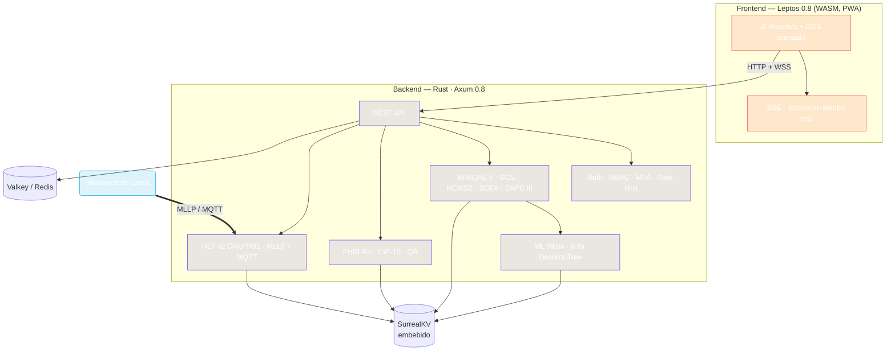

<div align="center">


# dMart UCI

### Sistema de Gestión de Unidad de Cuidados Intensivos, 100% en Rust

**Cuidados intensivos impulsados por código clínico compilado a WebAssembly.**

[](https://github.com/rooselvelt6/dmart/actions/workflows/ci.yml)
[](https://www.rust-lang.org/)
[](https://webassembly.org/)
[](https://leptos.dev/)
[](https://github.com/tokio-rs/axum)
[](https://surrealdb.com/)
[](.)
[](./dmart-server/tests/hl7_integration.rs)
[](#licencia)

</div>

---

## 🧬 ¿Qué es dMart?

**dMart** es una plataforma integral de gestión para **Unidades de Cuidados Intensivos (UCI)**
construida de punta a punta en **Rust** y compilada a **WebAssembly** con Leptos. No es una app "clínica en papel": es un sistema de registro de vida real que calcula automáticamente scores de severidad, estima riesgo de mortalidad e ingiere datos directamente desde los **monitores de cama**.

> **Rust + WASM + SurrealKV**: un solo binario, sin infraestructura externa, que funciona incluso **sin internet** en la red hospitalaria.

### Cálculo clínico serio
Cumple estándares internacionales de referencia:
- **APACHE II** (Knaus 1985) — 12 variables fisiológicas + edad + crónicos, máx **71 pts** con desglose `APS · Edad · Crónicos`
- **GCS**, **NEWS2**, **SOFA**, **SAPS III** — todos con validación de rangos clínicos
- **Riesgo de mortalidad hospitalaria** + **ML piloto** (linfa `DecisionTree`) con precisión ~85–90 %

---

## ✨ Características

| Área | Qué hace dMart |
|------|----------------|
| 🏥 **Gestión UCI** | Registro demográfico, ingreso/egreso con **desenlace** (Mejorado/Trasladado/Fallecido), historial y evolución |
| 📟 **Monitores de cama** | Parser **HL7 v2 (ORU^R01)** + transporte **MLLP** y **MQTT** — Mindray & Philips → mediciones automáticas |
| 🩺 **Scores clínicos** | APACHE II, GCS animado, NEWS2, SOFA, SAPS III y mortalidad en tiempo real |
| 📊 **Dashboard ejecutivo** | Heatmap de camas, mortalidad **predicha vs. real**, LOS, 6 KPIs de unidad |
| 🛏️ **Recursos** | Camas tipadas (General/Aislamiento/Pediátrica/Coronaria/Quemados), equipos asignados, staff |
| 🔄 **Interoperabilidad** | **FHIR R4**: Patient, Observation, Condition **CIE-10**, DiagnosticReport + **Código QR** |
| 🧾 **Exportación** | CSV y **PDF** por paciente |
| 🔌 **Operación offline** | **PWA**+Service Worker, base SurrealKV embebida, sin conexión requerida |
| 🌙 **UX moderna** | Glassmorphism, modo **dark/light**, responsive, severidad con animaciones |

---

## 🔒 Seguridad de grado hospitalario (HIPAA)

| Pilar | Implementación |
|-------|----------------|
| **Autenticación** | Argon2id (19 MiB por defecto), **JWT** revocable, **MFA TOTP** con códigos de respaldo |
| **Autorización** | **RBAC**: `Admin · Médico · Enfermero · Viewer`, permiso por ruta (`rbac.rs`) |
| **Cifrado** | **ChaCha20-Poly1305** + zeroización de secretos en memoria |
| **Auditoría PHI** | Log de acceso con retención de **6 años** |
| **Abuso** | Rate limiting por IP real, throttling de login, sanitización de entrada, **HSTS** |
| **QA defensivo** | **cargo-fuzz** (3 targets), **proptest** (bounds/monotonicidad/robustez), E2E Playwright, k6 |

### Matriz de permisos (resumen)

```
┌─────────────┬────────┬────────┬──────────┬────────┐
│ Permiso     │ Admin  │ Médico │ Enfermero│ Viewer │
├─────────────┼────────┼────────┼──────────┼────────┤
│ patients    │  ✅    │  ✅    │   —      │   —    │
│ measurements│  ✅    │  ✅    │   ✅     │   —    │
│ admin/BCK   │  ✅    │  —     │   —      │   —    │
│ audit       │  ✅    │  —     │   —      │   —    │
└─────────────┴────────┴────────┴──────────┴────────┘
```

---

## 🏗️ Arquitectura



---

## 🧰 Stack

| Capa | Tecnología | Nota |
|------|-----------|------|
| **Lenguaje** | Rust `1.98` · edition 2024 | MSRV fijada en `rust-toolchain.toml` |
| **Backend** | Axum `0.8` · Tokio | Async, streaming SSE, graceful shutdown |
| **Frontend** | Leptos `0.8` → WASM | CSR con PWA, TailwindCSS 3 |
| **Base de datos** | SurrealDB `2.x` (SurrealKV) | Embebida, migraciones SurrealQL idempotentes |
| **Cache** | Valkey / Redis `8+` | Sesiones y rate-limit |
| **ML** | linfa `0.7` · ndarray | Persistencia del modelo con bincode |
| **QA** | cargo-fuzz · proptest · k6 · Playwright | 3 targets / 136+ tests / 4 escenarios / 15 E2E |

---

## 🚀 Puesta en marcha

### Opción A — Docker (recomendado)

```bash
docker compose up --build -d                    # dev (server + valkey)
cp .env.staging.example .env.staging            # rellena DMART_MASTER_KEY
docker compose -f docker-compose.staging.yml up -d   # staging validado (R1/R4)

cp .env.prod.example .env.prod                  # rellena DMART_MASTER_KEY
docker compose -f docker-compose.prod.yml up -d     # prod (Caddy, HTTPS opcional vía SITE_ADDRESS)
```

### Opción B — Manual

```bash
# 1. Clona y compila
cargo build --release

# 2. Frontend WASM (CI usa cargo + wasm-bindgen; local Trunk)
cd dmart-app && trunk build && cd ..

# 3. Genera tu clave maestra (obligatoria) y arranca
export DMART_MASTER_KEY=$(openssl rand -hex 32)
./target/release/dmart-server
```

El servidor queda en **http://localhost:3000** con el usuario `admin`
(pasado por `DMART_ADMIN_PASSWORD`, o autogenerado y mostrado una vez en logs).

> Requisitos: Rust 1.98 (`rustup toolchain install 1.98.0 --component clippy,rustfmt`) · `trunk`

### Variables clave

| Variable | Default | Descripción |
|----------|---------|-------------|
| `DMART_MASTER_KEY` | *(obligatorio)* | Clave de cifrado — el server **no arranca** sin ella |
| `DMART_PORT` | `3000` | Puerto HTTP |
| `DMART_DB_PATH` | `./data/dmart.db` | Ruta SurrealKV |
| `DMART_ADMIN_PASSWORD` | *(vacío)* | Password inicial del admin |
| `DMART_VALKEY_URL` · `DMART_CORS_ORIGIN` · `RUST_LOG` | … | Ver `.env.example` |

---

## ✅ Calidad y gates

| Gate | Estado |
|------|--------|
| `cargo fmt --all -- --check` | ✅ limpio |
| `cargo clippy --workspace --all-targets -- -D warnings` | ✅ 0 warnings |
| `cargo test --workspace` | ✅ 121 tests Rust |
| Playwright E2E | ✅ 15 tests (login → pacientes → mediciones → admin) |
| k6 load | ✅ 4 escenarios · 100 VUs |
| cargo-fuzz | ✅ JSON / HL7 / escalas |
| Cobertura HL7 (parser + MLLP + ingest) | ✅ > 90 % |

```
Mantenimiento: 121 Rust tests + 8 benchmarks (criterion) + 15 E2E
```

---

## ⚡ Rendimiento

| Operación | Tiempo (bench) |
|-----------|----------------|
| APACHE II | **~4 ns** |
| GCS | ~1 ns |
| SOFA / NEWS2 | ~6 ns |
| SAPS III | ~32 ns |
| WASM bundle | **2.2 MB** optimizado |
| Crear / listar / obtener paciente | ~10 ms / ~5 ms / ~2 ms |

---

## 📂 Estructura

```
dmart/
├─ dmart-shared/   # Escalas clínicas, modelos, validación, ML
├─ dmart-server/   # Axum API · auth/RBAC · HL7+MLLP · FHIR · auditoría
│  ├─ hl7/         #   parser ORU^R01 · mllp · ingest (MQTT)
│  ├─ migrations/  #   SurrealQL versionado
│  └─ fuzz/        #   cargo-fuzz (json, hl7, scales)
├─ dmart-app/      # Frontend Leptos/WASM (PWA, Tailwind)
├─ specs/          # Spec-Driven Development (SPEC-001…006)
├─ tests/          # E2E (Playwright) · load (k6)
└─ docs/           # ARQUITECTURA (ADR) · API · APACHE_II · GCS
```

---

## 🗺️ Estado del proyecto

- **Fase 0–5 completadas** · v0.5.0 — núcleo clínico, seguridad, frontend, interoperabilidad y QA
- **En curso** — Fase 6: hardening y CI/CD (SPEC-003 HL7 done ✅)
- Detalles en [ROADMAP.md](./ROADMAP.md) y [CHANGELOG.md](./CHANGELOG.md)
- Cada feature nueva se desarrolla bajo [especificaciones SDD](./specs/) con criterios de aceptación Gherkin

---

## ✅ SPECs COMPLETADAS (cerradas con gate `clippy -D 0/0` + tests verdes)

| SPEC | Tema | Commit | Gate | Tests |
|------|------|--------|------|-------|
| 001 | Fix WASM build | — | ✅ | — |
| 002 | ML model persistence | — | ✅ | — |
| 003 | HL7 MLLP integration tests | — | ✅ | 32 |
| 004 | Auth/AuthZ hardening (JWT, MFA, RBAC) | — | ✅ | 31 |
| 005 | Prometheus/Grafana | — | ✅ | — |
| 006 | Docker multistage staging | — | ✅ | — |
| 007 | CI pipeline completo | — | ✅ | — |
| 008 | Alertas operativas | — | ✅ | — |
| 009 | Backup automático | — | ✅ | — |
| 010 | **Restore / DR** | `c662e1e` | 0/0 | 3 |
| 011 | **Runbook / On-call** | `c662e1e` | 0/0 | 2 |
| 012 | Production staging compose | — | ✅ | — |
| 013 | **FHIR R4 Bundle ingestion** | `5143791` | 0/0 | 4 |
| 014 | **Early-Warning Streaming (EWS)** | `5143791` | 0/0 | 4 |
| 027 | Coverage gate CI (llvm-cov ≥ 60 % global) | — | ✅ | — |
| 028 | Clinical reference vectors (conformance) | — | ✅ | 32+6 |
| 029 | Score fingerprint auditability | — | ✅ | — |
| 030 | Retention / downsampling | — | ✅ | — |
| 031 | **Bin/lib HL7 dedupe + 0 dead-code** | `bfecaf0` | 0/0 | 63 |

**Totales:** 146 tests verdes · clippy `-D warnings` = **0/0** en lib y bin · coverage global 65 % (SPEC-027)

---

## ⏳ SPECs PENDIENTES (14 — backlog numerado)

| Gap | Rango | Cuenta | Propuesta de arranque |
|-----|-------|--------|----------------------|
| 1 | **SPEC-015 — 016** | 2 | **015: Patient Timeline API** (historial longitudinal + eventsourcing) + **016: Clinical Decision Support rules** (motor reglas + FHIR PlanDefinition) |
| 2 | **SPEC-017 — 026** | 10 | Backlog "core platform": 017 Observability distribuida · 018 Multi-tenancy · 019 Export HL7/FHIR batch · 020 Tele-ICU streaming · 021 Capacity planning · 022 Device registry · 023 Alert escalation · 024 Data quality scoring · 025 Research cohort extraction · 026 Disaster recovery drill |
| 3 | **SPEC-032 — 033** | 2 | Proyección post-031: 032 ML model serving (ONNX + WASM) · 033 Patient similarity engine (embeddings) |

**Próximo paso natural (mañana):** abrir **SPEC-015 + 016 en paralelo** — ambas extienden `api/patients` + `scales`/`ml` existentes, alto valor clínico, sin romper gates.

---

## 🤝 Contribución

¿Bug, idea o mejora clínica? ¡Bienvenida! Revisa [ROADMAP.md](./ROADMAP.md), abre un *issue*
o un PR siguiendo el flujo SDD (*spec → implementación → tests → changelog*).

Reporta bugs · Sugiere features · Envía PRs · Úsalo libremente en proyectos académicos.

---

## 📄 Licencia

**MIT** — Copyright © 2026 · [rooselvelt6](https://github.com/rooselvelt6)

---

<div align="center">

*Hecho con ❤️ y Rust · Un solo binario para una UCI completa.*

</div>